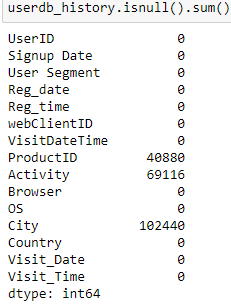
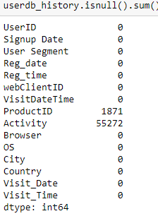

# Data_Analysis_Customer_Data
The main aim of the project is to Develop input features. I have used two datasets the Visitor log data and User Data. The datasets can be downloaded from the link https://datahack.analyticsvidhya.com/contest/job-a-thon-june-2021/download/train-file
Visitor Log Data – It is a browsing log data of all the visitors and the users. This table contains the following information:


Now based on the above two tables, you need to create an input feature set for the Marketing Model.


## Data Cleaning and Preprocessing
Merging both the above datasets on the UserID column, to create a userdatabase  


After merging I found that VisitDate has lots of missing values, The missing values of VisitDateTime columns cannot be filled so we are dropping the rows which have missing VisitDateTime entries

### Filling missing values in Country columns
While inspecting I found that lot of Country columns has empty strings, So I converted it into NaN values so that it becomes easy to filter out them and fill those values.


Now for missing values in the Country, I found some of the entries has the city name attached along with the country name in the Country columns,We need to separate the city from the country name. For this I have created a list of countries available in the world using pycountry module. After that I have created a function which will iterate throuugh every rows in the dataframe and with the help of regularexpression's findall method it will find the name is availble in our list created and if it finds  the name of the Country of the user in the Country list created, It will replace the country name those have city name attached with the actual country name. 

To fill the missing values in the country , I have used three different steps:
Some of the users have accesed the site from more than one country. So in order to fill the missing values of the Country.

#### There are three different approach:

1.For users which have ordered only from one single country ,we just need to map its userid to a dictionary which contain userid as key and its country name from which it has given maximum order as  value, It will give its country name.It won't matter if the city column is missing or not for users who have ordered from a single country.


2.For users which have ordered from more than 1 country and the City value is also missing for that particular entry ,We will fill the country column with that country from where he has ordered maximum number of times and later filling the city column by the city from which he has ordered maximum number of times of that country.

3.But the above process will not work for users who have ordered from more than 1 country and whose city value is not missing .Suppose a user has ordered from India and USA. If for a particular entry if the city name is given as NewYork and we found that the user has ordered maximum number of times from India. We will fill the country name with wrong value.It should be USA. For such cases we have to map both the userid and  city to get the country name.


After completing the above three steps most of the missing values have been filled but still some of the entries have missing data so I deleted those entries.


### Filling missing values of City


I have created a nested dictionary from the  dataframe where UserID is the main key and City name as the key of nested dictionary and the name of the Country as the value
The format of the dictionary will be   {'UserID':{'Country':'City'}}

After that I iterate through all the rows and fill the missing values by checking whether the UserID is in the dictionary keys or not and if it is present ,it will check whether the User has any country associated with it or not .if any country is found it willfill the missing place with value of the country key.



The remaining missing entries have no city value in the above dictionary for their respective UserID and Country key. It is best for us to drop the rows with missing values in City column as there is no way to fill those values .


### Filling the missing values ProductID

I created a nested dictionary from the dataframe where UserID is the main key and Visit_Date  as the key of nested dictionary and the name of the most viewed ProductID as the value. The format of the dictionary will be {'UserID':{'City':'Country'}}.
I Iterate through all the rows and filled the missing values by checking whether the UserID is in the dictionary keys or not and if it is present ,it will check whether the VisitDate is in it or not .if found we will fill the missing values with those  values of the key  and if missing values still exist I dropped those entries.



The remaining missing values in the Activity column will be dropped.

### Filling the missing values in Activity

In order to fill the missing values in the activity column I will use two separate ways
First way
Created a dictionary from the data frame where the UserID is the main key and the Visit_Date ,ProductID are the keys of the two  nested keys respectively. The format will be {UserID:{Visit_Dat:{ProdcutID:Activity}}}
The idea is to check first whether the UserID on the given Visit_Date has previous activity on  that ProductID or not .If any data relating to it is found we fill the missing values with those data i.e either CLICK or PAGELOAD


The missing numbers in Activity column has dropped to 35121 from 54981. The remaining missing values can be filled in the next way

Creating another dictionary from the dataframe where UserID is the key and the Activity is the value, This dictionary holds the most frequent activity of the user. Iterating through every rows in the database and checking whether the Activity column has  missing value or not, if yes it will check whether the userid of the particular entry is in.


The remaining missing values will be deleted


 

Now there is no missing values in our dataframe, and we can proceed to create the Input Features.

## Process to create Input Feature:

First I have created two separate dataframe of the last 7 days and 15 days and another dataframe which stores the total nummber of Products viewed by the user in the last 15 days.
```
lastseven=userdb_history[(dt.date(2018,5,27)-userdb_history['Visit_Date'])<=dt.timedelta(6)]

lastfifteen=userdb_history[(dt.date(2018,5,27)-userdb_history['Visit_Date'])<=dt.timedelta(14)]

otalproductsview=lastfifteen.groupby('UserID')['ProductID'].nunique().to_frame(name='No_Of_Products_Viewed_15Days').reset_index()
```

Created  two another dataframe which stores the most recently  viewed(Pageload) product by the user in last 15 day  and another which stores the ProductID which is most viewed by a particular user in the last 15 days respectively
```
recent15=lastfifteen[lastfifteen.Activity=='PAGELOAD'].groupby(['UserID','ProductID'])['Visit_Date','Visit_Time'].max().reset_index()

MviewPrdct=lastfifteen[lastfifteen.Activity=='PAGELOAD'].groupby('UserID')['ProductID'].value_counts().to_frame(name='Most_Viewed_Product_15Days').reset_index()
                                                                                       
```
After that merging Most recently viewed product dataframe and the most viewed product dataframe and storing in anoter variable df, sorting the above dataframe in ascending order and deleting the duplicates row

```
df=pd.merge(recent15,MviewPrdct,how='inner',on=['UserID','ProductID'])
df.sort_values(by=['UserID','Most_Viewed_Product_15Days','Visit_Date','Visit_Time'],inplace=True,ascending=False)
df.drop_duplicates(subset='UserID',inplace=True,ignore_index=True)
df.sort_values(by=['UserID'],ascending=True,inplace=True,ignore_index=True)

```
Created a dataframe which stores the unique UserId and it sfreqeunt choice of Operating System and another one which stores user segment of each user id
```
id_os=userdb_history.groupby('UserID')['OS'].value_counts().groupby(level=0).head(1).to_frame(name='Count').reset_index()[['UserID','OS']]
user_segment=userdb_history.groupby('UserID')['User Segment'].value_counts().to_frame(name='Count').reset_index()[['UserID','User Segment']]
```
The next step is to create the database which stores the date the registered date of each user and with the help of this I will create the vintage of each users.
```
v=userdb_history[['UserID','Reg_date']].drop_duplicates()
ctdate=userdb_history.Visit_Date.max()
v['Vintage(days)']=v['Reg_date'].apply(lambda x: (ctdate-x).days)
v.drop(labels='Reg_date',axis=1,inplace=True)
```
The next step is to create dataframes which stores numnber of time the userid was active on last seven days, the total number of clicks on last 7 days by each user , the total pageload in the last 7 days for each user and stores the recently viewed productid for each user.
```
active=lastseven.groupby('UserID')['Visit_Date'].nunique().to_frame(name='Days_active_on_last_7Days').reset_index()
click=lastseven[lastseven.Activity=='CLICK'].groupby('UserID')['Activity'].value_counts().to_frame(name='Clicks_last_7_days').reset_index()[['UserID','Clicks_last_7_days']]
pload=lastseven[lastseven.Activity=='PAGELOAD'].groupby('UserID'['Activity'].value_counts().to_frame(name='Pageload_last_7_days').reset_index([['UserID','Pageload_last_7_days']]
recent=userdb_history[userdb_history.Activity=='PAGELOAD'].groupby(['UserID','ProductID'])['Visit_Date','Visit_Time'].max().groupby(level=0).head(1).reset_index()
recent.drop(labels=['Visit_Date','Visit_Time'],inplace=True,axis=1)
recent.columns=['UserID','Recently_Viewed_Product']
```
The next step is to merge all the dataframes created above one by one.
Merging id_os dataframe with v dataframe and assigning to a varibale df1
```df1=id_os.merge(user_segment,on='UserID',how='outer')```
Merging id_os dataframe with v dataframe and assigning to a varibale df1
```df2=df1.merge(v,on='UserID',how='outer')```
Merging df1 dataframe with active dataframe and assigning to a varibale df2
```df3=df2.merge(active,on='UserID',how='outer')```
Merging df2 dataframe with click dataframe and assigning to a varibale df3
```df4=df3.merge(click,on='UserID',how='outer')```
Merging df3 dataframe with pload dataframe and assigning to a varibale df4
```df5=df4.merge(pload,on='UserID',how='outer')```
Merging df4 dataframe with active dataframe and assigning to a varibale data7
```data7=df5.merge(recent,on='UserID',how='outer')```
Filling missing values in Recently_Viewed_Product with Product101
```data7['Recently_Viewed_Product'].fillna(value='Product101',inplace=True)```
Merging the data7 and data15 dataframe to assigning to a varibale feature_table
```feature_table=pd.merge(data7,data15,how='outer',on='UserID')
feature_table.fillna(value=0,inplace=True)```

The feature_table contains all the necessary features which were required.
